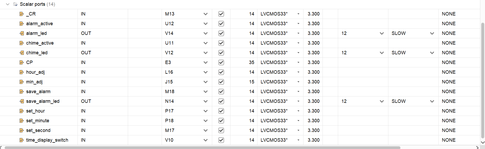
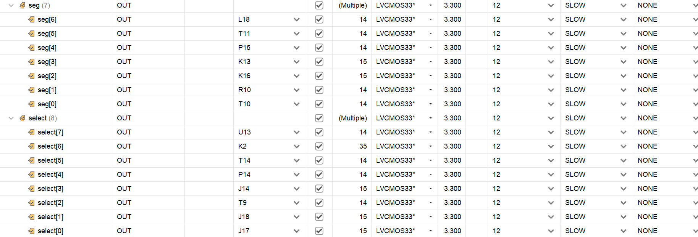
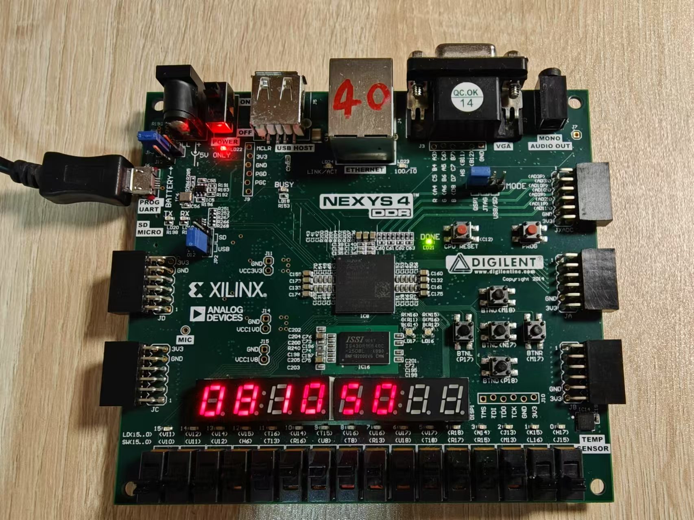
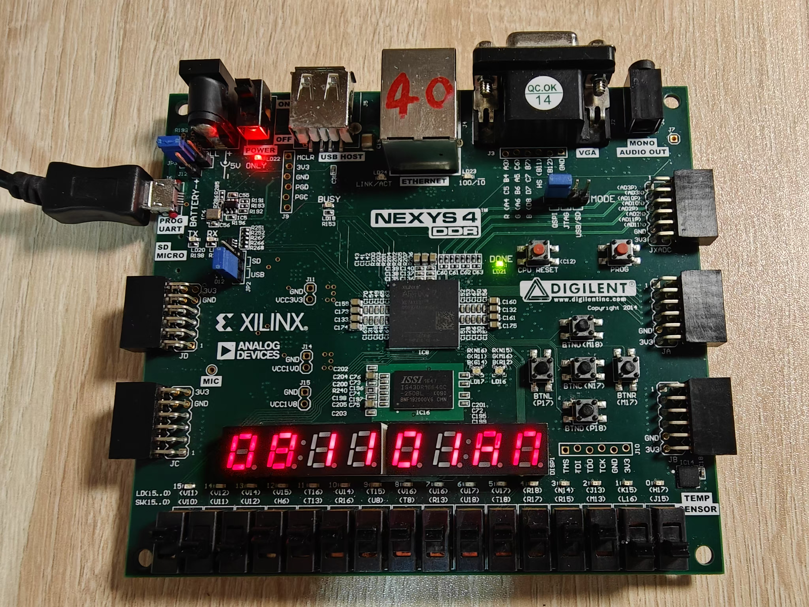
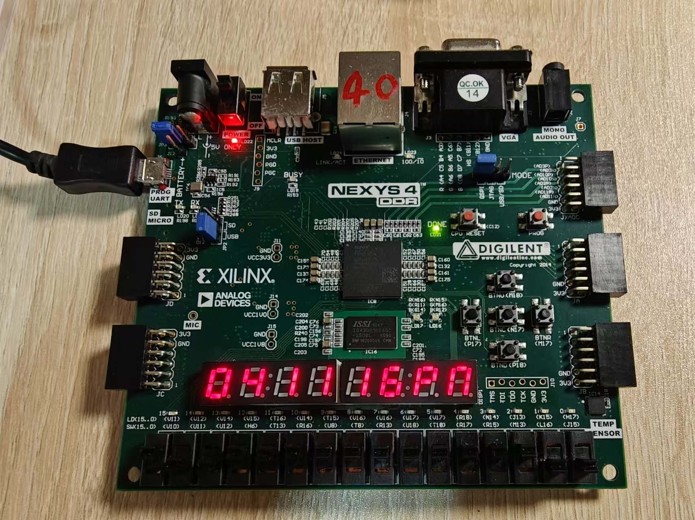

# Digital CLock Design as a DET Experiment

## Introduction

This project has built a digital clock based on **Nexys4 DDR FPGA board**. If confronted with any problems while using the board, check out the official reference manual:
[**Nexys4 DDR FPGA Board Reference Manual**](https://digilent.com/reference/_media/nexys4-ddr:nexys4ddr_rm.pdf)

## Function List

This digital clock is equipped with the following features:

1. displaying current time (24-hour mode and 12-hour mode)
2. adjusting the hour and minute of the clock
3. hourly chime (e.g. 4:00)
4. setting the alarm and alarming at the set time

## Manual & Demonstration

1. Dowload **Vivado** and import the design sources into your local project with project part *xc7a100tcsg324-1*
2. Assign pins as follows:

    
    

3. Generate Bitstream -> Program Device

### I/O information

Slide switches:

* V10: change between 24-hour and 12-hour display mode
* U11: activate/deactivate hourly chime
* U12: change between time-displaying mode and alarm-setting mode
* M13: asynchronous zero setting
* L16: adjust the hour
* J15: adjust the minute

*Addition*: if your want to try using slide switches to set the alarm time with `alarm_sw.v`, you can assign any other spare switches to the setting signals.

Pushbuttons:

* P17: set the hour of the alarm
* P18: set the minute of the alarm
* M17: set the second of the alarm
* M18: save the alarm time you set

LEDs:

* V12: hourly chime
* V14: lighting up when reaching the saved alarm time
* N14: reminder of successfully saving the alarm time

### Time Display

1. 24-hour mode

    

2. 12-hour mode

    
    

3. change between 24-hour and 12-hour mode

    <video>
        <source src="public/video/td.mp4" type="video/mp4" autoplay="true">
    <video\>

### Time Adjustment

1. adjust the hour

    <video>
        <source src="public/video/ad1.mp4" type="video/mp4" autoplay="true">
    <video\>
2. adjust the minute

    <video>
        <source src="public/video/ad2.mp4" type="video/mp4" autoplay="true">
    <video\>

### Hourly Chime

Chime at 4:00
    <video>
            <source src="public/video/hc.mp4" type="video/mp4" autoplay="true">
    <video\>

### Alarm

1. set the alarm time

    <video>
        <source src="public/video/al1.mp4" type="video/mp4" autoplay="true">
    <video\>

2. alarm at the set time

    <video>
        <source src="public/video/al2.mp4" type="video/mp4" autoplay="true">
    <video\>

## Module information

### `clock.v`

This this the top module of the whole project,
